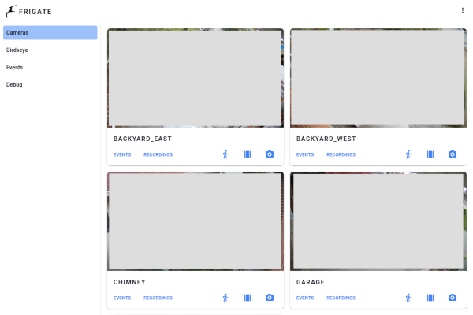

# ansible-role-homeassistant-frigate

An [Ansible](https://www.ansible.com/) role that provisions
[Home Assistant](https://www.home-assistant.io/),
[Frigate](https://github.com/blakeblackshear/frigate), and
[Mosquitto](https://mosquitto.org/)
[Docker](https://docs.docker.com/engine/installation/linux/docker-ce/ubuntu/) containers.

## Usage

```bash
make homeassistant-frigate

# Specific tags only:
ansible-playbook --ask-become-pass homeassistant-frigate.yml --tags customizations
ansible-playbook --ask-become-pass homeassistant-frigate.yml --tags docker
```

## Overview

This role automates the deployment and configuration of a complete home automation stack including:

- Home Assistant for core automation
- Frigate NVR for AI-powered camera management
- Mosquitto MQTT broker for device communication
- Optional local LLM capabilities
- Optional voice assistant features

[](https://github.com/andornaut/homeassistant-ibm1970-theme/blob/main/screenshots/light-colors-small.png)
[](./screenshots/frigate.png)

## Features

- Complete home automation platform with Home Assistant
- AI-powered video processing with Frigate
- MQTT message broker via Mosquitto
- Optional components:
  - Local LLM support
  - Voice assistant capabilities
- Hardware support for:
  - Coral.ai USB accelerator
  - Home Assistant SkyConnect
  - AirGradient sensors
  - Various smart home devices
- Network Video Recorder (NVR) with AI object detection
- Extensive custom card and integration support

## Requirements

- Ansible 2.9 or higher
- Ubuntu operating system
- Docker and Docker Compose

## Role Variables

See the default variables for each of the [./roles](./roles), for e.g. [letsencrypt-nginx variables](<h[ttps://github.com/andornaut/ansible-role-letsencrypt-nginx](https://github.com/andornaut/ansible-ctrl/blob/master/roles/homeassistant-frigate/defaults/main.yml)>).

Key variables include:

```yaml
# Enable optional components:
homeassistantfrigate_install_llm: true
homeassistantfrigate_install_voice: true

homeassistantfrigate_frigate_port_http_authenticated: 8971
homeassistantfrigate_frigate_port_http_unauthenticated: 5000
homeassistantfrigate_openwebui_port: 3000
```

## Services

### Home Assistant

- [Example automation.yaml](./examples/homeassistant/automations.yaml)
- [Example configuration.yaml](./examples/homeassistant/configuration.yaml)

Test configuration:

```bash
docker exec homeassistant hass --config /config --script check_config
docker exec homeassistant hass --config /config --script check_config --secrets
```

### Frigate

- [Example config.yml](./examples/frigate/config.yml)
- [GitHub issue #311](https://github.com/blakeblackshear/frigate/issues/311)

### Nginx

[letsencrypt-nginx variables](https://github.com/andornaut/ansible-ctrl/blob/master/roles/letsencrypt-nginx/defaults/main.yml):

```yaml
# Given:
homeassistantfrigate_homeassistant_port: 8123
homeassistantfrigate_frigate_port_http_unauthenticated: 5000
homeassistantfrigate_openwebui_port: 3000

# Nginx configuration:
letsencryptnginx_websites:
  - domain: frigate.example.com
    cloudflare_api_token: REDACTED
    cloudflare_api_zone: frigate.example.com
    csr_common_name: frigate.example.com
    permit_untrusted_networks: true
    proxy_port: 5000
    websocket_enabled: true
  - domain: ai.example.com
    cloudflare_api_token: REDACTED
    cloudflare_api_zone: ai.example.com
    csr_common_name: ai.example.com
    proxy_port: 3000
    websocket_path: /ws/socket.io
  - domain: ha.example.com
    cloudflare_api_token: REDACTED
    cloudflare_api_zone: ha.example.com
    csr_common_name: ha.example.com
    proxy_port: 8123
    websocket_path: /api/websocket
```

### LLM

- [@andornaut/til#artificial_intelligence](https://github.com/andornaut/til/blob/master/docs/artificial_intelligence.md#artificial-intelligence-ai)
- [Home LLM](https://github.com/acon96/home-llm)
- [How to control Home Assistant with a local LLM instead of ChatGPT](https://theawesomegarage.com/blog/configure-a-local-llm-to-control-home-assistant-instead-of-chatgpt)
- [llama.cpp](https://github.com/ggml-org/llama.cpp)
- [LocalAI](https://localai.io/basics/getting_started/)
- [Local LLM for dummies (forum thread)](https://community.home-assistant.io/t/local-llm-for-dummies/769407)
- [Models that support "tools"](https://ollama.com/search?c=tools)
  - [llama3.2:3b](https://ollama.com/library/llama3.2:3b)
  - [mistral:7b](https://ollama.com/library/mistral:7b)
  - [qwen3-vl:2b](https://ollama.com/library/qwen3-vl:2b) - Can also be used by Frigate
- [Ollama](https://ollama.com/)
- [Open WebUI](https://openwebui.com/)

Install models with:

```bash
docker exec ollama ollama pull mistral:7b
```

### Voice Assistant

- [Voice Preview Edition (hardware)](https://www.home-assistant.io/voice-pe/)
  - [Documentation](https://voice-pe.home-assistant.io/documentation/)
- [Local voice documentation](https://www.home-assistant.io/voice_control/voice_remote_local_assistant/)

#### Home Assistant integration

- [Google Generative AI Conversation](https://www.home-assistant.io/integrations/google_generative_ai_conversation/)
- [OpenAI Conversation](https://www.home-assistant.io/integrations/openai_conversation/)
  - [Extended OpenAI Conversation](https://github.com/jekalmin/extended_openai_conversation)
- [Wyoming protocol](https://www.home-assistant.io/integrations/wyoming)

#### Software

- [microWakeWord](https://github.com/kahrendt/microWakeWord)
  - [Docker image](https://hub.docker.com/r/rhasspy/wyoming-microwakeword)
  - [model collection](https://github.com/esphome/micro-wake-word-models/tree/main/models/v2) - Used by Home Assistant Voice Preview (hardware)
- [Matter](https://github.com/home-assistant-libs/python-matter-server)
  - [A complete typescript implementation of the Matter protocol specification](https://github.com/project-chip/matter.js)
  - [Chip tool](https://github.com/project-chip/connectedhomeip/tree/c438b8945e26a84f68ba3608de202e4b939a9080/examples/chip-tool)
  - [Operating System requirements](https://github.com/home-assistant-libs/python-matter-server/blob/main/docs/os_requirements.md)
- [openWakeWord](https://github.com/dscripka/openWakeWord)
  - [Create your own wake word](https://www.home-assistant.io/voice_control/create_wake_word/)
  - [Docker image](https://github.com/rhasspy/wyoming-openwakeword)
  - [ipython notebook to train wakewords](https://colab.research.google.com/drive/1q1oe2zOyZp7UsB3jJiQ1IFn8z5YfjwEb?usp=sharing#scrollTo=qgaKWIY6WlJ1)
  - [model collection](https://github.com/fwartner/home-assistant-wakewords-collection)
- [Piper](https://github.com/rhasspy/piper)
  - [Docker image](https://github.com/rhasspy/wyoming-piper)
  - [Home Assistant docs](https://github.com/home-assistant/addons/blob/master/piper/DOCS.md)
  - [Voices](https://rhasspy.github.io/piper-samples/)
- [Whisper](https://github.com/openai/whisper)
  - [Docker image](https://github.com/rhasspy/wyoming-faster-whisper)
  - [Home Assistant docs](https://github.com/home-assistant/addons/blob/master/whisper/DOCS.md)

## Hardware

- [Coral.ai USB accelerator](https://coral.ai/products/accelerator/)

### AirGradient

- [Official website](https://www.airgradient.com/)
  - [Dashboard](https://app.airgradient.com/dashboard)
  - [Integrations](https://www.airgradient.com/integrations/)
  - [Online firmware flashing tool](https://www.airgradient.com/documentation/factory/)
- [Official Home Assistant integration](https://www.home-assistant.io/integrations/airgradient)
- [Alternative Home Assistant integration](https://github.com/MallocArray/airgradient_esphome)

#### Configuring AirGradient for Home Assistant

1. [Install ESPHome](https://esphome.io/guides/installing_esphome#linux)
1. Download [airgradient-one.yaml](https://raw.githubusercontent.com/MallocArray/airgradient_esphome/refs/heads/main/airgradient-one.yaml)
1. Change the `name` and `friendly_name` properties of `airgradient-one.yaml`:

   ```yaml
   substitutions:
     name: airgradient
     friendly_name: airgradient
   ```

1. Add your wifi details to `airgradient-one.yaml`:

   ```yaml
   wifi:
     ssid: <insert password>
     password: <insert password>
   ```

1. Run `esphome run airgradient-one.yaml` (you may be prompted to install missing dependencies, suh as `pillow`)
1. Navigate to the ESPHome integration on your Home Assistant installation
1. Click "Add Device" and follow the prompts to setup your new airgradient device

### AMD GPU

Make `/dev/kfd` (AMD GPU compute) writable from within the container:

- [AMD GPU driver installation](https://github.com/andornaut/til/blob/master/docs/ubuntu.md#install-amd-gpu-dkms-kernel-module-driver)

Edit `/etc/udev/rules.d/70-amdgpu.rules` to change the group from "render" to "video",
because the Ollama container doesn't have a "render" group,
and therefore docker compose `group_add` can't add a valid "render" group ID.

```text
KERNEL=="kfd", GROUP="video", MODE="0660"
```

Recreate `/dev/kfd` by running:

```bash
sudo udevadm control --reload
sudo udevadm trigger
```

### Bluetooth

#### CSR8510 adapter

- [dbus-broker](https://github.com/bus1/dbus-broker/wiki)
- [Home Assistant/bluetooth](https://www.home-assistant.io/integrations/bluetooth)

#### M5Stack bluetooth proxy

Installation

1. Plug the [M5Stack product page](https://www.aliexpress.com/item/1005003299215808.html) into a usb port
2. Navigate to [ESPHome bluetooth proxy installation](https://esphome.io/projects/index.html) in Google Chrome
3. From the "I want to create a:" options, select "Bluetooth proxy"
4. From the "Pick the device you want to turn into a Bluetooth proxy: " options, select "M5Stack"
5. Click the "Connect" button
6. Select a port, then begin the installation
7. Once the installation is complete, configure the Wifi network
8. From Home Assistant, add a new ESPHome device and point to the hostname of the newly connected M5Stack

### Home Assistant Connect ZBT-1 (Zigbee and Thread hub)

- [Hardware](https://www.seeedstudio.com/Home-Assistant-SkyConnect-p-5479.html)
- [Official documentation](https://connectzbt1.home-assistant.io/)
- [Thread](https://www.home-assistant.io/integrations/thread/#list-of-thread-border-router-devices)
  - [Enabling thread support](https://support.nabucasa.com/hc/en-us/articles/26124710072861-Enabling-Thread-support)

### SMLight SLZB-MR1

- [AliExpress SMLight store](https://www.aliexpress.com/item/1005008814854495.html)
- [SMLight SLZB-MR1 Multi-Radio Coordinator Setup and Review](https://smarthomescene.com/reviews/smlight-slzb-mr1-multi-radio-coordinator-setup-and-review/)

### ratgdo - Local MQTT & dry contact control of Chamberlain/LiftMaster Security+ 2.0 garage door openers

- [ratgdo](https://paulwieland.github.io/ratgdo/)
- [ratgdo-compatible alternative hardware](https://www.gelidus.ca/product/gelidus-research-ratgdo-alternative-board-v2-usb-c/)
  Getting started

1. Choose between:
   - (Option A) Flash the MQTT firmware for "ratgdo v2.51, Security + 1.0, 2.0 & Dry Contact" using [this web installer](https://paulwieland.github.io/ratgdo/flash.html)
     - [Download MQTT firmware](https://github.com/ratgdo/mqtt-ratgdo)
     - The webapp will prompt you to configure WiFi
   - (Option B) Flash the ESPHome firmware using [this web installer](https://ratgdo.github.io/esphome-ratgdo/)
1. Navigate to the admin web interface
1. Set a MQTT IP and port:1883. You must use an IP not a hostname.
1. Leave the "Home Assistant Discovery Prefix" at its default "homeassistant"
1. Wire the ratgdo to the garage door opener according to [this diagram](https://user-images.githubusercontent.com/4663918/276749741-fe82ea10-e8f4-41d6-872f-55eec88d2aab.png)
1. Navigate to Home Assistant > Settings > Devices & services > Devices and then search for "ratgdo"
1. Add a new card to your dashboard:

   ```yaml
   show_name: true
   show_icon: true
   type: button
    entity: cover.ratgdo_door
   name: Garage Door
   tap_action:
     action: toggle
   show_state: true
   ```

### Roborock vacuums

- [Mop control](https://community.home-assistant.io/t/s7-mop-control/317393/42)
- [Commands](https://github.com/marcelrv/XiaomiRobotVacuumProtocol?tab=readme-ov-file)

[Custom mode](https://github.com/marcelrv/XiaomiRobotVacuumProtocol/blob/master/custom_mode.md)

```yaml
service: vacuum.send_command
target:
  entity_id: vacuum.roborock_q_revo_s
data:
  command: set_custom_mode
  params: [{ { custom_mode } }]
```

| Vacuum mode | Description    |
| ----------- | -------------- |
| 101         | Silent         |
| 102         | Balanced       |
| 103         | Turbo          |
| 104         | Max            |
| 105         | Off (mop only) |
| 106         | Custom (Auto)  |

[Water Box Custom Mode](https://github.com/marcelrv/XiaomiRobotVacuumProtocol/blob/master/water_box_custom_mode.md#set-water-box-custom-mode)

```yaml
service: vacuum.send_command
target:
  entity_id: vacuum.roborock_q_revo_s
data:
  command: set_water_box_custom_mode
  params: [{ { water_box_custom_mode } }]
```

| Water box custom mode | Flow level      |
| --------------------- | --------------- |
| 200                   | Off             |
| 201                   | Low             |
| 202                   | Medium          |
| 203                   | High            |
| 204                   | Custom (Auto)   |
| 207                   | Custom (Levels) |

```yaml
service: vacuum.send_command
target:
  entity_id: vacuum.roborock_q_revo_s
data:
  command: set_mop_mode
  params: [{ { mop_mode } }]
```

| Mop mode | Description |
| -------- | ----------- |
| 300      | Standard    |
| 301      | Deep        |
| 302      | Custom      |
| 303      | Deep+       |

### Sensi Thermostat

- [/r/homeassistant/ post](https://github.com/andornaut/ansible-role-homeassistant-frigate/edit/main/README.md)

Setup HomeKit:

1. Reset the thermostat to factory settings
1. Begin the thermostat setup process via the Sensi app
1. Prior to configuring WIFI, the thermostat will display a pairing code - take note of this.
1. Continue with the setup process via the Sensi app, but switch to Home Assistant once you've connected the thermostat to WIFI
1. Home Assistant should now detect a new HomeKit device, which you should begin configuring
1. When prompted for a "pairing code", enter the code noted above, and then complete the setup procedure
1. Complete the Sensi app setup procedure

### [SONOFF Zigbee 3.0 USB Dongle Plus](https://itead.cc/product/sonoff-zigbee-3-0-usb-dongle-plus/) (CC2652P)

Upgrading SONOFF Zigbee 3.0 USB Dongle Plus (ZBDongle-P) firmware:

- [Firmware](https://github.com/Koenkk/Z-Stack-firmware/)
- [Instructions for ZBDongle-P](https://sonoff.tech/wp-content/uploads/2023/02/SONOFF-Zigbee-3.0-USB-dongle-plus-firmware-flashing.pdf)
- [How-to: Flashing the firmware via cc2538-bsl](https://www.zigbee2mqtt.io/guide/adapters/flashing/flashing_via_cc2538-bsl.html)
- [How to Use SONOFF Dongle Plus on Home Assistant](https://sonoff.tech/product-review/how-to-use-sonoff-dongle-plus-on-home-assistant-how-to-flash-firmware/)
- [Sonoff Zigbee 3.0 USB Dongle Plus - How to upgrade the firmware (Video)](https://www.youtube.com/watch?v=KBAGWBWBATg)

```bash
docker stop homeassistant
docker run --rm \
    --device /dev/ttyUSB0:/dev/ttyUSB0 \
    -e FIRMWARE_URL=https://github.com/Koenkk/Z-Stack-firmware/raw/master/coordinator/Z-Stack_3.x.0/bin/CC1352P2_CC2652P_launchpad_coordinator_20230507.zip \
    ckware/ti-cc-tool -ewv -p /dev/ttyUSB0 --bootloader-sonoff-usb
```

## Troubleshooting

### Avahi and Google Cast

- [Google Cast with Docker - No Google Cast devices found](https://community.home-assistant.io/t/google-cast-with-docker-no-google-cast-devices-found/145331/24)

> On the host `tcpdump port 5353 -i any`
> On the docker container, get a shell on the container and `apk add tcpdump && tcpdump port 5353`

### Converting ONNX model to DFP for memryx

- [Memryx driver installation](https://github.com/blakeblackshear/frigate/blob/dev/docker/memryx/user_installation.sh) - n.b. These packages are "held" and won't be upgraded without manual intervention

1. Add the Frigate+ model to Frigate's `config.yml`:

   ```yaml
   model:
    path: plus://<Model ID> # yolov9s 320x320 3472  onnx,rocm,openvino,rknn,zmq 2025-11-03  2025.3
   ```

2. Start Frigate, which will download the model to `/var/docker-volumes/homeassistant-frigate/frigate/config/model_cache/`. Once Frigate has downloaded the model, stop its container.

3. Rename the model file to include an ".onnx" filename extension:

   ```bash
   mv <Model ID> 2025-11-04-yolov9s.onnx
   mv <Model ID>.json 2025-11-04-yolov9s.json
   ```

4. Get the model's width and height (you'll use these values in subsequent steps):

   ```bash
   cat 2025-11-04-yolov9s.json | jq -r '"\(.width),\(.height)"'
   ```

5. Convert the model to DFP format:

   ```bash
   # Set `--input_shapes` to  `1,3,${width},${height}`
   mx_nc --models 2025-11-04-yolov9s.onnx --dfp_fname 2025-11-04-yolov9s.dfp --input_shapes "1,3,320,320" --autocrop --effort hard --num_processes 8 --verbose

   # Monitor memryx for thermal throttling with:
   watch 'cat /sys/memx0/temperature'

   # n.b. Inclue the newly created "*_post.onnx" file
   zip 2025-11-04-yolov9s.zip 2025-11-04-yolov9s.dfp 2025-11-04-yolov9s_post.onnx

   sudo cp 2025-11-04-yolov9s.zip /var/docker-volumes/homeassistant-frigate/frigate/config/
   ```

6. Create a label map file:

   ```bash
   cat 2025-11-04-yolov9s.json |jq -r '.labelMap | to_entries[] | "\(.key) \(.value)"' > 2025-11-04-yolov9s.txt
   sudo cp 2025-11-04-yolov9s.txt /var/docker-volumes/homeassistant-frigate/frigate/config/
   ```

7. Update Frigate's `config.yml`, and then restart Frigate:

   ```yaml
   model:
     # https://deploy-preview-20786--frigate-docs.netlify.app/configuration/object_detectors#yolov9
     path: /config/2025-11-04-yolov9s.zip
     labelmap_path: /config/2025-11-04-yolov9s.txt
     width: 320
     height: 320
     input_dtype: float
     input_tensor: nchw
     model_type: yolo-generic
   ```

### Removing unwanted entities and devices

- [Remove leftover-devices and -entities from integration that is uninstalled](https://community.home-assistant.io/t/remove-leftover-devices-and-entities-from-integration-that-is-uninstalled/316391)

Context: Some devices cannot be delete from the UI, such as old devices in the Ruckus Unleashed integration.

1. Rename the unwanted device names and entity IDs to contain the word "\_deprecated"
1. Run `docker stop homeassistant`
1. Delete all entries with the word "\_deprecated" from `./.storage/core.entity_registry` `core.device_registry`
1. Run `docker start homeassistant`
1. Run [`recorder.purge_entities`](https://www.home-assistant.io/integrations/recorder/#action-purge_entities) service with the "entity_globs" field set to e.g. "device_tracker.\*\_deprecated"

#### Removing unwanted MQTT entities

1. Install [MQTT Explorer](https://mqtt-explorer.com/)
1. User `docker inspect` to get the IP address of the `mosquitto` container, then connect to it using MQTT Explorer
1. Delete the unwanted topic, e.g. `ratgdo`
1. Delete related sub-topics of `homeassistant`, e.g. `homeassistant/cover/ratgdo`

### Upgrade, downgrade or pin a component's dependencies

Eg. Pin [pyenvisalink](https://github.com/Cinntax/pyenvisalink)
to version 4.0 to workaround
[this issue](https://github.com/home-assistant/core/issues/65762#issuecomment-1030872475).

```bash
docker exec -ti homeassistant \
    bash -c "find /usr/src/homeassistant/ \
    -name 'requirements*.txt' -or -name manifest.json \
    | xargs grep -l pyenvisalink \
    | xargs sed -i 's/pyenvisalink==[a-zA-Z0-9.]\+/pyenvisalink==4.0/g'"
```

Or upgrade the offending dependency directly as in these Ansible tasks:

```bash
- name: "Install pexpect from the 'master' branch. Workaround 1/2 for: https://github.com/home-assistant/core/issues/94264"
  community.docker.docker_container_exec:
    container: homeassistant
    argv:
      - /bin/bash
      - "-c"
      - "pip install https://github.com/pexpect/pexpect/archive/master.zip"

- name: "Restart the homeassistant container. Workaround 2/2 for: https://github.com/home-assistant/core/issues/94264"
  community.docker.docker_container:
    name: homeassistant
    state: started
    restart: true
```

### Coral.ai doesn't work

- [Failed to load delegate from libedgetpu.so.1.0](https://github.com/blakeblackshear/frigate/issues/3259)

`docker logs frigate` shows an error:

> ValueError: Failed to load delegate from libedgetpu.so.1.0

Try rebooting the host OS or restarting the Docker container.

When debugging, note that when a Coral.ai USB adpater is first connected its manufacturer is listed as "Global Unichip Corp",
[but then it changes](https://github.com/google-coral/edgetpu/issues/536) to "Google Inc." after its first inference, so look for both manufacturer names: `lsusb | grep -E 'Global|Google'`

Excerpt from dmesg:

```text
[  303.677695] usb 3-2: new high-speed USB device number 22 using xhci_hcd
[  303.827453] usb 3-2: New USB device found, idVendor=1a6e, idProduct=089a, bcdDevice= 1.00
[  303.827457] usb 3-2: New USB device strings: Mfr=0, Product=0, SerialNumber=0
[  334.017843] usb 3-2: reset high-speed USB device number 22 using xhci_hcd
[  336.329848] usb 3-2: reset high-speed USB device number 22 using xhci_hcd
[  336.478836] usb 3-2: device firmware changed
[  336.478857] usb 3-2: USB disconnect, device number 22
[  336.606068] usb 3-2: new high-speed USB device number 23 using xhci_hcd
[  336.755606] usb 3-2: New USB device found, idVendor=18d1, idProduct=9302, bcdDevice= 1.00
[  336.755611] usb 3-2: New USB device strings: Mfr=0, Product=0, SerialNumber=0
```

### Reolink doorbell stops working

If the Reolink doorbell stops working (no chime, no quick reply, no siren) when integrated with Frigate:

**Solution**: Switch from RTSP to HTTP streams and disable two-way audio in Frigate.

References:

- [Frigate discussion #13904](https://github.com/blakeblackshear/frigate/discussions/13904)
- [Frigate issue #3235](https://github.com/blakeblackshear/frigate/issues/3235#issuecomment-1135876973)
- [Reolink camera configuration docs](https://docs.frigate.video/configuration/camera_specific/#reolink-cameras)

**Root cause**: The Reolink doorbell is designed such that when two-way audio is enabled via Frigate, the doorbell chime, quick reply messages, and siren will not work.

**Solution**:

1. Use HTTP-FLV streams instead of RTSP in Frigate configuration
2. Do not enable two-way audio between the Reolink doorbell and Frigate
3. Use Frigate's restream feature to send video to Home Assistant
4. Enable the native Reolink integration in Home Assistant for full doorbell functionality (chime, quick reply, siren)

**Camera settings** (if available):

- Set to "On, fluency first" (CBR/constant bit rate)
- Set "Interframe Space 1x" (iframe interval matching frame rate)
- Enable HTTP in camera's advanced network settings

**Example Frigate configuration** (go2rtc streams using HTTP-FLV):

```yaml
go2rtc:
  streams:
    doorbell:
      - ffmpeg:https://camera-doorbell.example.com/flv?port=1935&app=bcs&stream=channel0_main.bcs&user={FRIGATE_RTSP_USER}&password={FRIGATE_RTSP_PASSWORD}#audio=copy#video=copy#audio=opus
    doorbell_sub:
      - ffmpeg:https://camera-doorbell.example.com/flv?port=1935&app=bcs&stream=channel0_ext.bcs&user={FRIGATE_RTSP_USER}&password={FRIGATE_RTSP_PASSWORD}
```

Notes:

- The `#audio=copy#video=copy#audio=opus` suffix converts audio to opus codec while copying video
- HTTP-FLV streams are more reliable than RTSP for Reolink cameras
- For direct IP camera connections, use the hostname/IP; for NVR connections, use `channel[0..15]` in the stream URL

## Documentation and Resources

- [BurningStone91's smart home setup](https://github.com/Burningstone91/smart-home-setup/)
- [FFmpeg QuickSync](https://trac.ffmpeg.org/wiki/Hardware/QuickSync)
- [FFmpeg VAAPI](https://trac.ffmpeg.org/wiki/Hardware/VAAPI)
- [Frigate machine learning accelerator by Coral](https://coral.ai/products/)
- [Frigate mobile app notifications blueprint](https://community.home-assistant.io/t/frigate-mobile-app-notifications/311091)
- [HA Docker with OTBR Docker](https://community.home-assistant.io/t/ha-docker-with-otbr-docker/735288)
- [Home Assistant automation trigger variables](https://www.home-assistant.io/docs/automation/templating/)
- [Home Assistant script syntax](https://www.home-assistant.io/docs/scripts/)
- [How to Pair Reolink Doorbell with Chime V1](https://support.reolink.com/hc/en-us/articles/32888306699673-How-to-Pair-Reolink-Doorbell-with-Chime-Doorbell-PoE-WiFi/#h_01J0A0VKTD7TXF1WAXX7JBY456)
- [IBM1970 theme](https://github.com/andornaut/homeassistant-ibm1970-theme)
- [Material icons](https://materialdesignicons.com/) - Customize Home Assistant icons. Prefix with "mdi:".
- [Mosquitto](https://mosquitto.org/) - MQTT message broker
- [SgtBatten's HA blueprints](https://github.com/SgtBatten/HA_blueprints)

### Custom Cards

- [Advanced camera card](https://github.com/dermotduffy/advanced-camera-card)
- [Bubble card](https://github.com/Clooos/Bubble-Card)
- [Button card](https://github.com/custom-cards/button-card/)
- [Card mod](https://github.com/thomasloven/lovelace-card-mod)
- [Layout card](github.com/thomasloven/lovelace-layout-card)
- [Mini media player](https://github.com/kalkih/mini-media-player)
- [Slider entity row](https://github.com/thomasloven/lovelace-slider-entity-row/)

### Integrations

#### Built-in

- [Amcrest](https://www.home-assistant.io/integrations/amcrest/)
- [Denon AVR](https://www.home-assistant.io/integrations/denonavr/)
- [Ecobee](https://www.home-assistant.io/integrations/ecobee/)
- [Elgato Light](https://www.home-assistant.io/integrations/elgato/)
- [Envisalink](https://www.home-assistant.io/integrations/envisalink/)
  - [Envisalink Refactored](https://github.com/ufodone/envisalink_new) - Independent rewrite
  - [esphome-dsckeybus](https://github.com/Dilbert66/esphome-dsckeybus)
- [Google Cast](https://www.home-assistant.io/integrations/cast/)
- [HomeKit](https://www.home-assistant.io/integrations/homekit/)
- [Matter](https://www.home-assistant.io/integrations/matter/)
- [OpenAI](https://www.home-assistant.io/integrations/openai_conversation)
- [Open Thread Border Router (OTBR)](https://www.home-assistant.io/integrations/otbr/)
  - [HASS OTBR Docker image](https://github.com/ownbee/hass-otbr-docker)
- [Roborock](https://www.home-assistant.io/integrations/roborock/)
  - [pfsense Nat 1:1 workaround](https://github.com/rytilahti/python-miio/issues/422#issuecomment-573408811)
  - [Xiaomi-cloud-tokens-extractor](https://github.com/PiotrMachowski/Xiaomi-cloud-tokens-extractor)
- [Ruckus Unleashed](https://www.home-assistant.io/integrations/denonavr/)
- [Thread](https://www.home-assistant.io/integrations/thread/)
- [Zigbee Home Automation](https://www.home-assistant.io/integrations/zha/)

#### Custom integrations

- [Bambu Lab](https://github.com/greghesp/ha-bambulab)
- [Dreo (unofficial)](https://github.com/JeffSteinbok/hass-dreo) - Supports more devices than the official integration
  - [Dreo (official)](https://github.com/dreo-team/hass-dreoverse)
- [Frigate](https://github.com/blakeblackshear/frigate-hass-integration)
  - [Frigate camera notifications automation blueprint](https://github.com/SgtBatten/HA_blueprints/tree/main/Frigate_Camera_Notifications)
- [Govee2MQTT](https://github.com/wez/govee2mqtt)
- [Keymaster](https://github.com/FutureTense/keymaster)
- [Meross](https://github.com/albertogeniola/meross-homeassistant)
- [Sensei Thermostat](https://github.com/iprak/sensi)
- [Simpleicons](https://github.com/vigonotion/hass-simpleicons)

## License

MIT License. See [LICENSE](../../LICENSE) for full details.
