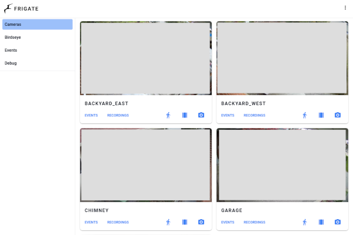

# ansible-role-homeautomation

An [Ansible](https://www.ansible.com/) role that provisions
[Home Assistant](https://www.home-assistant.io/),
[Frigate](https://github.com/blakeblackshear/frigate),
[Mosquitto](https://mosquitto.org/), and related services as
[Docker](https://docs.docker.com/engine/installation/linux/docker-ce/ubuntu/) containers.

[](https://github.com/andornaut/homeassistant-ibm1970-theme/blob/main/screenshots/light-colors-small.png)
[](./screenshots/frigate.png)

## Usage

```bash
make homeautomation

ansible-playbook --ask-become-pass homeautomation.yml --tags customizations
ansible-playbook --ask-become-pass homeautomation.yml --tags docker
```

## Variables

See [defaults/main.yml](./defaults/main.yml) for all available variables.

```yaml
# Enable optional components:
homeautomation_install_frigate: true
homeautomation_install_llm: true
homeautomation_install_matter: true
homeautomation_install_voice: true

homeautomation_frigate_port_http_authenticated: 8971
homeautomation_frigate_port_http_unauthenticated: 5000
homeautomation_openwebui_port: 3000
```

## Services

### Home Assistant

- [Example automation.yaml](./examples/homeassistant/automations.yaml)
- [Example configuration.yaml](./examples/homeassistant/configuration.yaml)

Test configuration:

```bash
docker exec homeassistant hass --config /config --script check_config
docker exec homeassistant hass --config /config --script check_config --secrets
```

### Frigate

- [Example config.yml](./examples/frigate/config.yml)
- [GitHub issue #311](https://github.com/blakeblackshear/frigate/issues/311)

### Nginx

Configure reverse proxies using [letsencrypt-nginx variables](https://github.com/andornaut/ansible-ctrl/blob/master/roles/letsencrypt-nginx/defaults/main.yml):

```yaml
letsencryptnginx_websites:
  - domain: frigate.example.com
    proxy_port: 5000
    websocket_enabled: true
  - domain: ai.example.com
    proxy_port: 3000
    websocket_path: /ws/socket.io
  - domain: ha.example.com
    proxy_port: 8123
    websocket_path: /api/websocket
```

### LLM

- [llama.cpp](https://github.com/ggml-org/llama.cpp)
- [Open WebUI](https://openwebui.com/)
- [Home LLM](https://github.com/acon96/home-llm)
- [Extended OpenAI Conversation](https://github.com/jekalmin/extended_openai_conversation)
- [Local LLM for dummies (forum thread)](https://community.home-assistant.io/t/local-llm-for-dummies/769407)

### Voice Assistant

- [Voice Preview Edition (hardware)](https://www.home-assistant.io/voice-pe/) - [Documentation](https://voice-pe.home-assistant.io/documentation/)
- [Local voice documentation](https://www.home-assistant.io/voice_control/voice_remote_local_assistant/)
- [Wyoming protocol](https://www.home-assistant.io/integrations/wyoming)
- [Piper](https://github.com/rhasspy/piper) - Text-to-speech. [Voices](https://rhasspy.github.io/piper-samples/)
- [Whisper](https://github.com/openai/whisper) - Speech-to-text
- [microWakeWord](https://github.com/kahrendt/microWakeWord) - Wake word detection
- [openWakeWord](https://github.com/dscripka/openWakeWord) - [Create your own wake word](https://www.home-assistant.io/voice_control/create_wake_word/)

### Matter / Thread

- [matter.js](https://github.com/project-chip/matter.js)
- [HASS OTBR Docker image](https://github.com/ownbee/hass-otbr-docker)
- [HA Docker with OTBR Docker](https://community.home-assistant.io/t/ha-docker-with-otbr-docker/735288)

#### Pairing Matter Devices

Prerequisites:

- A Thread Border Router (e.g., [Home Assistant Connect ZBT-1](#home-assistant-connect-zbt-1))
- Matter devices and controllers on the same L2 network
- IPv6 networking enabled (link-local addresses are sufficient)

Pairing steps:

1. Factory reset the device (see device-specific steps below)
1. In the Home Assistant mobile app, go to Settings > Devices & Services > Matter > Add device > No. It's new
1. Scan the QR code on the device with the mobile app
1. Wait for commissioning to complete

##### Pairing from a different subnet (ethernet adapter method)

If your phone's WiFi network is on a different subnet than the Thread Border Router / Matter server, the standard pairing flow will fail during device discovery. The workaround is to use a USB-C ethernet adapter to temporarily place the phone on the same LAN as the Thread Border Router. Replace steps 3-5 above with:

1. In the Home Assistant mobile app, go to Settings > Devices & Services > Matter > Add device > No. It's new
1. Scan the device's QR code
1. Plug the ethernet adapter into the phone
1. Wait approximately 4 seconds, then tap "I'm ready"

The timing is critical: the pairing flow first performs a WiFi connectivity check before starting discovery. The ethernet adapter must be plugged in *after* the tapping "I'm ready", so that the connectivity check passes over WiFi while the subsequent mDNS discovery occurs on the ethernet LAN.

##### Inovelli White Series Switch

[Product page](https://inovelli.com/products/thread-matter-white-series-smart-2-1-on-off-dimmer-switch) |
[Setup instructions](https://help.inovelli.com/en/articles/9692499-white-series-dimmer-switch-setup-instructions-home-assistant)

- Factory reset: hold the top paddle (on) and config/favorites button (button above the LED) simultaneously for 20 seconds until the LED bar turns red and blinks 3 times
- Pairing mode: the LED bar should pulse blue automatically after reset. If not, quickly tap the config/favorites button 3 times

##### Eve Energy Outlet (In-Wall, 10ECN4151 / 20ECN4101)

[Product page](https://www.evehome.com/en-us/eve-energy-outlet) |
[Support](https://www.evehome.com/en-us/support/eve-energy)

- Factory reset: press the right LED for 10 seconds

##### Eve Door & Window Contact Sensor

[Eve Door & Window](https://www.evehome.com/en-us/eve-door-window) |
[Support](https://www.evehome.com/en-us/support/eve-door-window)

- Factory reset: open the battery compartment and press the reset button with a paperclip until the red LED blinks

## Hardware

### AirGradient

- [Official website](https://www.airgradient.com/) - [Dashboard](https://app.airgradient.com/dashboard)
- [Official Home Assistant integration](https://www.home-assistant.io/integrations/airgradient)
- [Alternative Home Assistant integration](https://github.com/MallocArray/airgradient_esphome)

Configuring for Home Assistant:

1. [Install ESPHome](https://esphome.io/guides/installing_esphome#linux)
1. Download [airgradient-one.yaml](https://raw.githubusercontent.com/MallocArray/airgradient_esphome/refs/heads/main/airgradient-one.yaml)
1. Set `name` and `friendly_name` in `airgradient-one.yaml`, and add your wifi credentials
1. Run `esphome run airgradient-one.yaml`
1. Add the device via the ESPHome integration in Home Assistant

### AMD GPU

Make `/dev/kfd` (AMD GPU compute) writable from within the container:

- [AMD GPU driver installation](https://github.com/andornaut/til/blob/master/docs/ubuntu.md#install-amd-gpu-dkms-kernel-module-driver)

Edit `/etc/udev/rules.d/70-amdgpu.rules`:

```text
KERNEL=="kfd", GROUP="video", MODE="0660"
```

```bash
sudo udevadm control --reload
sudo udevadm trigger
```

### Bluetooth

- [dbus-broker](https://github.com/bus1/dbus-broker/wiki)
- [Home Assistant/bluetooth](https://www.home-assistant.io/integrations/bluetooth)

M5Stack bluetooth proxy:

1. Plug in the [M5Stack](https://www.aliexpress.com/item/1005003299215808.html) via USB
1. Navigate to [ESPHome bluetooth proxy installation](https://esphome.io/projects/index.html) in Chrome
1. Select "Bluetooth proxy" > "M5Stack", connect, install, and configure WiFi
1. Add the new ESPHome device in Home Assistant

### Home Assistant Connect ZBT-1

- [Official documentation](https://connectzbt1.home-assistant.io/)
- [Thread](https://www.home-assistant.io/integrations/thread/#list-of-thread-border-router-devices) - [Enabling thread support](https://support.nabucasa.com/hc/en-us/articles/26124710072861-Enabling-Thread-support)

### SMLight SLZB-MR1

- [AliExpress](https://www.aliexpress.com/item/1005008814854495.html)
- [Setup and review](https://smarthomescene.com/reviews/smlight-slzb-mr1-multi-radio-coordinator-setup-and-review/)

### Coral.ai USB Accelerator

- [Product page](https://coral.ai/products/accelerator/)

### ratgdo (Garage Door Opener)

- [ratgdo](https://paulwieland.github.io/ratgdo/)
- [Alternative hardware](https://www.gelidus.ca/product/gelidus-research-ratgdo-alternative-board-v2-usb-c/)

Setup:

1. Flash the [MQTT firmware](https://github.com/ratgdo/mqtt-ratgdo) using the [web installer](https://paulwieland.github.io/ratgdo/flash.html), or the [ESPHome firmware](https://ratgdo.github.io/esphome-ratgdo/)
1. Set the MQTT IP and port (1883) in the admin web interface. Use an IP, not a hostname.
1. Wire the ratgdo according to [this diagram](https://user-images.githubusercontent.com/4663918/276749741-fe82ea10-e8f4-41d6-872f-55eec88d2aab.png)
1. Add the device in Home Assistant > Settings > Devices & services

### Roborock Vacuums

- [Commands](https://github.com/marcelrv/XiaomiRobotVacuumProtocol?tab=readme-ov-file)
- [Mop control](https://community.home-assistant.io/t/s7-mop-control/317393/42)

[Custom mode](https://github.com/marcelrv/XiaomiRobotVacuumProtocol/blob/master/custom_mode.md):

| Mode | Description    |
| ---- | -------------- |
| 101  | Silent         |
| 102  | Balanced       |
| 103  | Turbo          |
| 104  | Max            |
| 105  | Off (mop only) |
| 106  | Custom (Auto)  |

[Water box custom mode](https://github.com/marcelrv/XiaomiRobotVacuumProtocol/blob/master/water_box_custom_mode.md#set-water-box-custom-mode):

| Mode | Flow level      |
| ---- | --------------- |
| 200  | Off             |
| 201  | Low             |
| 202  | Medium          |
| 203  | High            |
| 204  | Custom (Auto)   |
| 207  | Custom (Levels) |

Mop mode:

| Mode | Description |
| ---- | ----------- |
| 300  | Standard    |
| 301  | Deep        |
| 302  | Custom      |
| 303  | Deep+       |

### Sensi Thermostat

Setup via HomeKit:

1. Reset the thermostat to factory settings
1. Begin setup via the Sensi app
1. Note the pairing code displayed before configuring WiFi
1. Complete WiFi setup via Sensi, then switch to Home Assistant
1. Add the new HomeKit device in Home Assistant using the noted pairing code
1. Complete the Sensi app setup

### SONOFF Zigbee 3.0 USB Dongle Plus (CC2652P)

Firmware upgrade:

- [Firmware](https://github.com/Koenkk/Z-Stack-firmware/)
- [Instructions](https://sonoff.tech/wp-content/uploads/2023/02/SONOFF-Zigbee-3.0-USB-dongle-plus-firmware-flashing.pdf)
- [Flashing via cc2538-bsl](https://www.zigbee2mqtt.io/guide/adapters/flashing/flashing_via_cc2538-bsl.html)

```bash
docker stop homeassistant
docker run --rm \
    --device /dev/ttyUSB0:/dev/ttyUSB0 \
    -e FIRMWARE_URL=https://github.com/Koenkk/Z-Stack-firmware/raw/master/coordinator/Z-Stack_3.x.0/bin/CC1352P2_CC2652P_launchpad_coordinator_20230507.zip \
    ckware/ti-cc-tool -ewv -p /dev/ttyUSB0 --bootloader-sonoff-usb
```

## Troubleshooting

### Avahi and Google Cast

- [Google Cast with Docker - No Google Cast devices found](https://community.home-assistant.io/t/google-cast-with-docker-no-google-cast-devices-found/145331/24)

Debug with: `tcpdump port 5353 -i any` on the host, and `apk add tcpdump && tcpdump port 5353` inside the container.

### Converting ONNX model to DFP for Memryx

- [Memryx driver installation](https://github.com/blakeblackshear/frigate/blob/dev/docker/memryx/user_installation.sh) - packages are "held" and won't auto-upgrade

1. Add the Frigate+ model to Frigate's `config.yml`:

   ```yaml
   model:
    path: plus://<Model ID>
   ```

2. Start Frigate to download the model to `/var/docker-volumes/homeautomation/frigate/config/model_cache/`, then stop it.

3. Rename the model file:

   ```bash
   mv <Model ID> 2025-11-04-yolov9s.onnx
   mv <Model ID>.json 2025-11-04-yolov9s.json
   ```

4. Get the model dimensions:

   ```bash
   cat 2025-11-04-yolov9s.json | jq -r '"\(.width),\(.height)"'
   ```

5. Convert to DFP:

   ```bash
   mx_nc --models 2025-11-04-yolov9s.onnx --dfp_fname 2025-11-04-yolov9s.dfp --input_shapes "1,3,320,320" --autocrop --effort hard --num_processes 8 --verbose

   # Monitor for thermal throttling:
   watch 'cat /sys/memx0/temperature'

   # Include the newly created "*_post.onnx" file
   zip 2025-11-04-yolov9s.zip 2025-11-04-yolov9s.dfp 2025-11-04-yolov9s_post.onnx
   sudo cp 2025-11-04-yolov9s.zip /var/docker-volumes/homeautomation/frigate/config/
   ```

6. Create a label map:

   ```bash
   cat 2025-11-04-yolov9s.json | jq -r '.labelMap | to_entries[] | "\(.key) \(.value)"' > 2025-11-04-yolov9s.txt
   sudo cp 2025-11-04-yolov9s.txt /var/docker-volumes/homeautomation/frigate/config/
   ```

7. Update Frigate's `config.yml`:

   ```yaml
   model:
     path: /config/2025-11-04-yolov9s.zip
     labelmap_path: /config/2025-11-04-yolov9s.txt
     width: 320
     height: 320
     input_dtype: float
     input_tensor: nchw
     model_type: yolo-generic
   ```

### Frigate restart loop with MemryX

If Frigate is in a restart loop and `docker logs frigate` shows:

```text
[error] [Client] No devices in system, please check the server
[DFPRunner] Error in client->init_conenction local mode for device: FIXME
Failed to initialize MemryX model: Init DFP Runner failed!
frigate.watchdog INFO: Detection appears to have stopped. Exiting Frigate...
```

The MemryX kernel module (`memx_cascade_plus_pcie`) is not loaded, so `/dev/memx0` doesn't exist and the `mxa-manager` service has no devices. This can happen after a kernel upgrade or reboot.

Verify with:

```bash
ls /dev/memx0          # Should exist
lsmod | grep memx      # Should show memx_cascade_plus_pcie
lspci | grep -i memryx # Should show the MX3 PCI device
```

Fix by re-running the memryx Ansible tasks, which will load the module and restart the manager:

```bash
ansible-playbook --ask-become-pass homeautomation.yml --tags memryx
docker restart frigate
```

Or manually:

```bash
sudo modprobe memx_cascade_plus_pcie
sudo systemctl restart mxa-manager
docker restart frigate
```

### Coral.ai doesn't work

- [Failed to load delegate from libedgetpu.so.1.0](https://github.com/blakeblackshear/frigate/issues/3259)

If `docker logs frigate` shows `ValueError: Failed to load delegate from libedgetpu.so.1.0`, try rebooting or restarting the container.

Note: Coral.ai USB manufacturer changes from "Global Unichip Corp" to "Google Inc." [after first inference](https://github.com/google-coral/edgetpu/issues/536). Check with: `lsusb | grep -E 'Global|Google'`

### Removing unwanted entities and devices

- [Forum thread](https://community.home-assistant.io/t/remove-leftover-devices-and-entities-from-integration-that-is-uninstalled/316391)

1. Rename unwanted device names and entity IDs to contain "\_deprecated"
1. `docker stop homeassistant`
1. Delete entries with "\_deprecated" from `./.storage/core.entity_registry` and `core.device_registry`
1. `docker start homeassistant`
1. Run [`recorder.purge_entities`](https://www.home-assistant.io/integrations/recorder/#action-purge_entities) with entity_globs set to e.g. `device_tracker.*_deprecated`

Removing MQTT entities:

1. Install [MQTT Explorer](https://mqtt-explorer.com/) and connect to the mosquitto container IP
1. Delete the unwanted topic and related sub-topics under `homeassistant/`

### Pinning a component's dependencies

```bash
docker exec -ti homeassistant \
    bash -c "find /usr/src/homeassistant/ \
    -name 'requirements*.txt' -or -name manifest.json \
    | xargs grep -l pyenvisalink \
    | xargs sed -i 's/pyenvisalink==[a-zA-Z0-9.]\+/pyenvisalink==4.0/g'"
```

### Reolink doorbell stops working

When two-way audio is enabled via Frigate, the doorbell chime, quick reply, and siren stop working.

Solution: Use HTTP-FLV streams instead of RTSP and disable two-way audio in Frigate. Use the native Reolink integration in Home Assistant for full doorbell functionality.

- [Frigate discussion #13904](https://github.com/blakeblackshear/frigate/discussions/13904)
- [Reolink camera configuration docs](https://docs.frigate.video/configuration/camera_specific/#reolink-cameras)

Example go2rtc configuration:

```yaml
go2rtc:
  streams:
    doorbell:
      - ffmpeg:https://camera-doorbell.example.com/flv?port=1935&app=bcs&stream=channel0_main.bcs&user={FRIGATE_RTSP_USER}&password={FRIGATE_RTSP_PASSWORD}#audio=copy#video=copy#audio=opus
    doorbell_sub:
      - ffmpeg:https://camera-doorbell.example.com/flv?port=1935&app=bcs&stream=channel0_ext.bcs&user={FRIGATE_RTSP_USER}&password={FRIGATE_RTSP_PASSWORD}
```

## Resources

### Custom Cards

- [Advanced camera card](https://github.com/dermotduffy/advanced-camera-card)
- [Bubble card](https://github.com/Clooos/Bubble-Card)
- [Button card](https://github.com/custom-cards/button-card/)
- [Card mod](https://github.com/thomasloven/lovelace-card-mod)
- [Layout card](https://github.com/thomasloven/lovelace-layout-card)
- [Mini media player](https://github.com/kalkih/mini-media-player)
- [Slider entity row](https://github.com/thomasloven/lovelace-slider-entity-row/)

### Integrations

Built-in:

- [Amcrest](https://www.home-assistant.io/integrations/amcrest/)
- [Denon AVR](https://www.home-assistant.io/integrations/denonavr/)
- [Ecobee](https://www.home-assistant.io/integrations/ecobee/)
- [Elgato Light](https://www.home-assistant.io/integrations/elgato/)
- [Envisalink](https://www.home-assistant.io/integrations/envisalink/) - [Envisalink Refactored](https://github.com/ufodone/envisalink_new)
- [Google Cast](https://www.home-assistant.io/integrations/cast/)
- [HomeKit](https://www.home-assistant.io/integrations/homekit/)
- [Matter](https://www.home-assistant.io/integrations/matter/)
- [OpenAI](https://www.home-assistant.io/integrations/openai_conversation)
- [OTBR](https://www.home-assistant.io/integrations/otbr/)
- [Roborock](https://www.home-assistant.io/integrations/roborock/)
- [Thread](https://www.home-assistant.io/integrations/thread/)
- [Zigbee Home Automation](https://www.home-assistant.io/integrations/zha/)

Custom:

- [Bambu Lab](https://github.com/greghesp/ha-bambulab)
- [Dreo](https://github.com/JeffSteinbok/hass-dreo)
- [Frigate](https://github.com/blakeblackshear/frigate-hass-integration) - [Notifications blueprint](https://github.com/SgtBatten/HA_blueprints/tree/main/Frigate_Camera_Notifications)
- [Govee2MQTT](https://github.com/wez/govee2mqtt)
- [Keymaster](https://github.com/FutureTense/keymaster)
- [Meross](https://github.com/albertogeniola/meross-homeassistant)
- [Sensi Thermostat](https://github.com/iprak/sensi)
- [Simpleicons](https://github.com/vigonotion/hass-simpleicons)

### Other

- [IBM1970 theme](https://github.com/andornaut/homeassistant-ibm1970-theme)
- [Material icons](https://materialdesignicons.com/) - prefix with "mdi:"
- [QuickBars (app)](https://quickbars.app/)
- [Viewer for Frigate](https://play.google.com/store/apps/details?id=com.frigateviewer)
- [SgtBatten's HA blueprints](https://github.com/SgtBatten/HA_blueprints)
- [BurningStone91's smart home setup](https://github.com/Burningstone91/smart-home-setup/)
- [Frigate mobile app notifications blueprint](https://community.home-assistant.io/t/frigate-mobile-app-notifications/311091)
